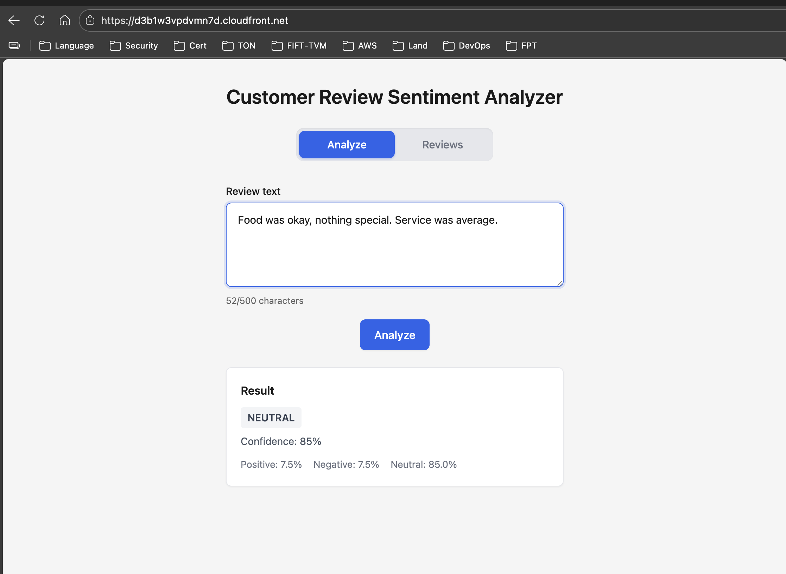
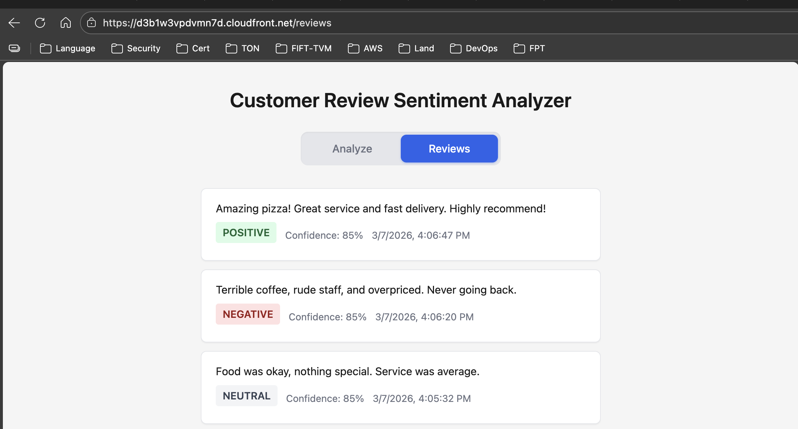
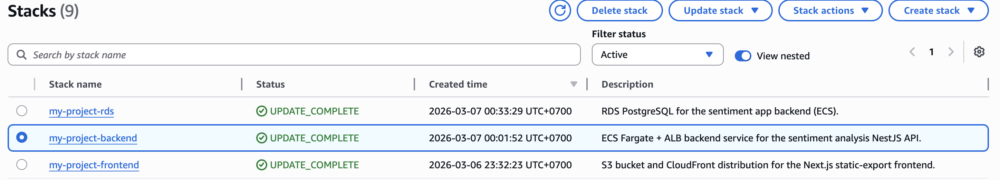

# Customer Review Sentiment Analyzer

A fullstack **sentiment analysis** application for customer reviews: submit review text, get Positive/Negative/Neutral classification with confidence scores, and persist results. Built with **Next.js** (frontend), **NestJS** (backend), **PostgreSQL** (Prisma), and deployed on **AWS** (S3 + CloudFront for the UI, ECS Fargate + RDS for the API and database).

---

## Demo Screenshots

| Screen | Description |
|--------|-------------|
| [](docs/assets/Analyze.png) | **Analyze** — Submit review text and view sentiment result with confidence and score breakdown. |
| [](docs/assets/Reviews.png) | **Reviews** — List of all analyzed reviews with sentiment and metadata. |
| [](docs/assets/Stacks.png) | **AWS Stacks** — CloudFormation stacks (network, RDS, backend, frontend) used for deployment. |

*(If images are missing, add them under `docs/assets/`.)*

---

## Documentation

| Document | Description |
|----------|-------------|
| [**Project results & rationale**](docs/PROJECT-RESULTS-README.md) | What was delivered, why Next.js static export on S3/CloudFront was chosen (POC/demo, static web), and how to run/deploy. |
| [**Requirements**](requirements.md) | Original assessment requirements (API, frontend, sentiment spec, testing). |
| [**Backend**](backend/README.md) | NestJS API: setup, scripts, sentiment training, Prisma, Docker. |
| [**Frontend**](frontend/README.md) | Next.js app: setup, scripts, static export, env. |
| [**Infrastructure (AWS)**](infra-aws/README.md) | CloudFormation templates, deploy scripts, RDS/ECS/S3/CloudFront, troubleshooting. |
| [**Architecture**](infra-aws/ARCHITECTURE.md) | AWS architecture diagram (Mermaid), components, and data flow. |

---

## Prerequisites

| Tool | Version | Required For |
|------|---------|-------------|
| **Node.js** | >= 18 | Backend and frontend |
| **npm** | >= 9 | Dependency management |
| **Docker** | Latest | Building backend container image for ECS deployment |
| **AWS CLI v2** | Latest | Deploying infrastructure (VPC, ECS, RDS, S3, CloudFront, ECR) |
| **PostgreSQL** | >= 14 | Local development (or use the default SQLite provider for quick local runs) |
| **Git** | Latest | Cloning the repository |

> **Note:** For local development only, the Prisma schema defaults to **SQLite** (`backend/prisma/schema.prisma` → `provider = "sqlite"`), so PostgreSQL is not strictly required to run locally. Docker and AWS CLI are only needed for cloud deployment.

---

## Quick start (local)

The fastest way to run the app locally is with the **run-all** script. From the repository root:

```bash
./run-all.sh
```

This script will:

- Copy `.env.example` to `.env` in both frontend and backend if not already present
- Start PostgreSQL via Docker Compose (if Docker is available)
- Install npm dependencies in `frontend/` and `backend/` if needed
- Run Prisma generate, then start the backend (NestJS on port **3001**) and frontend (Next.js on port **3000**) in the same terminal

When ready, open **http://localhost:3000** in your browser. Press **Ctrl+C** to stop both processes.

**Manual run (alternative):**  
Backend: `cd backend && cp .env.example .env && npx prisma migrate deploy && npm run start:dev`  
Frontend: `cd frontend && cp .env.example .env.local && npm run dev`  
*(See [backend/README.md](backend/README.md) and [frontend/README.md](frontend/README.md) for details.)*

---

## System Design Summary

- **Frontend** — Next.js 14 (App Router), TypeScript. Static export (`output: 'export'`) → HTML/JS/CSS only. Hosted on **S3**, served via **CloudFront** (HTTPS, edge cache). A CloudFront function maps `/reviews` to `reviews.html`. The UI calls the backend API over HTTPS (API also behind CloudFront).
- **Backend** — NestJS 11, Prisma 7, PostgreSQL. Endpoints: `POST /analyze` (submit + classify + store), `GET /reviews` (list), `GET /health` (liveness). Sentiment uses the **natural** library (Bayes classifier) trained on `datasets/data.csv` and knowledge cases. Runs in **ECS Fargate** (Docker), behind an **ALB** and a **CloudFront** distribution for HTTPS and CORS.
- **Database** — **RDS PostgreSQL** in private subnets; backend connects with SSL (`sslmode=require&uselibpqcompat=true`). Prisma migrations and an optional startup script (`ensure-db-grants`) handle schema and permissions.
- **Infrastructure** — **CloudFormation**: VPC, subnets, NAT; RDS; ECS cluster, task definition, ALB, API CloudFront; S3 bucket, frontend CloudFront. One script `infra-aws/deploy/deploy-all.sh` runs the full deploy (network → RDS → backend build/push/deploy → frontend build/deploy/upload → CORS update).

---

## Architecture Rationale: From PoC to Cloud

The [original requirements](requirements.md) describe a straightforward local app — Next.js frontend, NestJS backend, SQLite database, and Jest tests. The current architecture goes further: PostgreSQL instead of SQLite, and full AWS deployment. Below is the reasoning behind these changes.

### Why PostgreSQL Instead of SQLite

The requirements suggest **SQLite with Prisma ORM**. SQLite is convenient for a local prototype — zero setup, data lives in a single file. However, it has real limitations when moving beyond a throwaway demo:

- **Data durability** — SQLite stores everything in one file on disk. If that file is corrupted, accidentally deleted, or lost during a container restart or disk failure, **all data is gone** with no built-in recovery mechanism.
- **Performance at scale** — As the database file grows, read/write performance degrades. SQLite uses file-level locking and is not designed for concurrent writers, which becomes a bottleneck under load.
- **Production readiness** — PostgreSQL is a full client-server RDBMS with WAL (Write-Ahead Logging) for crash recovery, MVCC for concurrent access, and robust tooling for backups and replication. On AWS, **RDS PostgreSQL** adds automated backups, point-in-time recovery, failover, and managed patching out of the box.

> **Local development:** The Prisma schema (`backend/prisma/schema.prisma`) still uses `provider = "sqlite"` for quick local runs with zero setup. For AWS deployment, the provider switches to PostgreSQL via the `DATABASE_URL` environment variable.

### PoC to Cloud: Real-World Challenges

A PoC that works on `localhost` encounters many new issues when deployed to the cloud. Since this is a small PoC and the frontend has no SSR/ISR requirements, Next.js was configured as a **static export** (`output: 'export'`) and deployed to **S3 + CloudFront** — lightweight, highly available, and cost-effective.

However, this introduced a specific challenge:

**Client-side navigation breaks on S3.** In local development (`npm run dev`), `next/link` handles client-side routing seamlessly. But when the static export is served from S3, direct navigation to `/reviews` fails — S3 looks for an object key `/reviews` which does not exist (the actual file is `reviews.html`). There are three approaches to solve this:

1. **Use `<a>` tags** instead of `next/link` — forces full page reloads, losing the SPA experience.
2. **Set `trailingSlash: true`** in `next.config.js` — Next.js then generates `/reviews/index.html`, which S3 resolves naturally when configured with an index document.
3. **CloudFront Function** — a lightweight edge function that rewrites the URI (e.g., `/reviews` → `/reviews.html`) before S3 receives the request.

This project uses option **3** (CloudFront Function), which preserves the `next/link` client-side navigation in the code while letting S3 serve the correct HTML files. The tradeoff is an extra piece of infrastructure to maintain.

This is a real-world lesson: even a simple PoC reveals deployment-specific issues (routing, CORS, HTTPS mixed content, database connectivity) that simply don't exist when running `npm run dev` locally.

---

## Results Achieved

- **API** — `POST /analyze` and `GET /reviews` implemented with validation, error handling, and persistence; sentiment logic with configurable training data; health endpoint for load balancers.
- **Frontend** — Analyze form (max 500 chars), result display (sentiment + confidence + scores), Reviews list, tab navigation. Static export for simple, low-cost hosting.
- **Database** — PostgreSQL schema via Prisma (e.g. `Review`); migrations; RDS deployment with SSL and permission handling.
- **Testing** — Backend unit and e2e tests (Jest); frontend tests (Vitest); coverage.
- **Deployment** — Full AWS deploy via CloudFormation and scripts; frontend on S3/CloudFront; backend on ECS Fargate with ALB and API CloudFront.

---

## Repository Structure

```
├── backend/           # NestJS API (Prisma, sentiment, Docker)
├── frontend/          # Next.js app (static export)
├── infra-aws/         # CloudFormation templates and deploy scripts
├── docs/              # Project results, demo assets
├── requirements.md    # Assessment requirements
└── README.md          # This file
```

**Local run:** Use `./run-all.sh` for a one-command quick start (see [Quick start (local)](#quick-start-local) above). For manual setup, see [backend/README.md](backend/README.md) and [frontend/README.md](frontend/README.md).

**Deploy to AWS:**  
Configure `infra-aws/.env` (e.g. `RDS_MASTER_PASSWORD`) and run `./infra-aws/deploy/deploy-all.sh` from the repo root. See [infra-aws/README.md](infra-aws/README.md).
