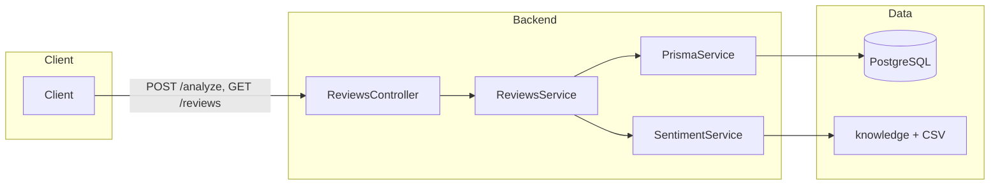
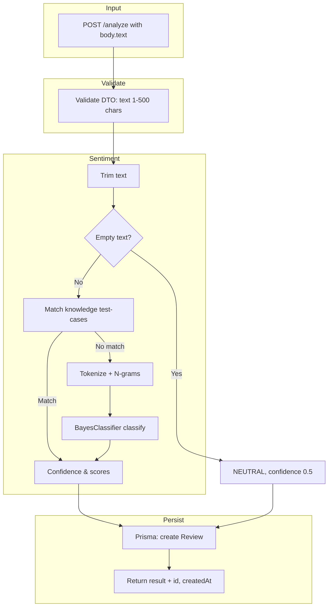
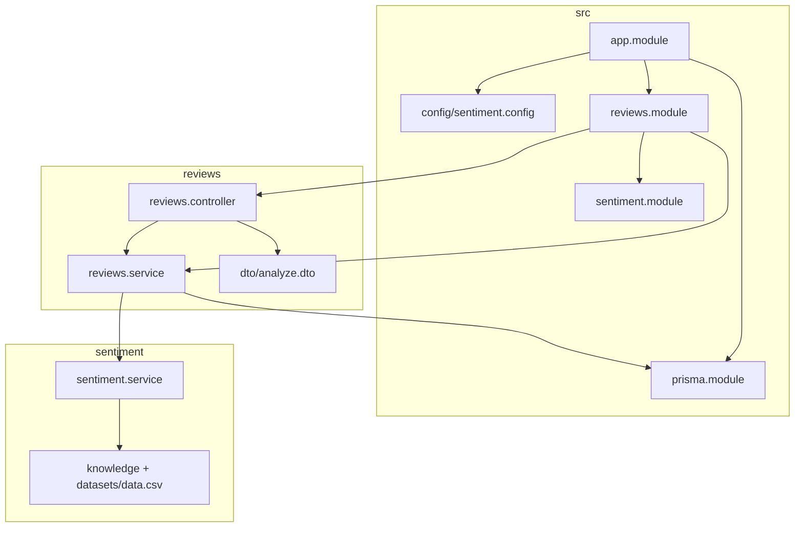

# Backend — Sentiment Reviews API

NestJS API for sentiment analysis (positive / negative / neutral) from review text, persisting to PostgreSQL and returning the list of saved reviews.

## Tech stack

- **Runtime:** Node.js ≥ 22.9
- **Framework:** NestJS 11, Express
- **DB:** PostgreSQL (Prisma 7 + `@prisma/adapter-pg`)
- **Sentiment:** `natural` library (BayesClassifier), trained from `test-cases.json` + `datasets/data.csv`
- **Validation:** class-validator, class-transformer
- **Config:** @nestjs/config, environment variables

## Requirements

- Node.js ≥ 22.9
- PostgreSQL (local or Docker)
- Yarn or npm

## Installation & run

```bash
# Install dependencies
yarn install

# Copy env and edit if needed
cp .env.example .env

# Prisma: generate client + migrate
npx prisma generate
npx prisma migrate deploy   # or migrate dev when developing

# Run dev (default port 3001)
yarn start:dev
```

**Run with Docker (Postgres + Backend):**

```bash
docker-compose up -d postgres   # DB only
# or
docker-compose up -d            # DB + backend (port 3000)
```

## Scripts

| Script            | Description                  |
| ----------------- | ---------------------------- |
| `yarn start`      | Run app (production)         |
| `yarn start:dev`  | Run with watch (development) |
| `yarn start:prod` | Run from build `node .`      |
| `yarn build`      | Build to `dist/`             |
| `yarn test`       | Run unit tests (Jest)        |
| `yarn test:cov`   | Run tests + coverage report  |
| `yarn test:e2e`   | Run E2E tests                |

## API

Default base URL: `http://localhost:3001`

### POST `/analyze`

Analyze sentiment and save review.

**Body (JSON):**

```json
{
  "text": "Review content (1–500 characters)"
}
```

**Response (201):**

```json
{
  "sentiment": "POSITIVE",
  "confidence": 0.92,
  "scores": { "positive": 0.92, "negative": 0.04, "neutral": 0.04 },
  "id": "clxx...",
  "createdAt": "2025-03-06T..."
}
```

### GET `/reviews`

Get the list of saved reviews (newest first).

**Response (200):** Array of objects with `id`, `text`, `sentiment`, `confidence`, `scores`, `createdAt`, `updatedAt`.

---

## Configuration (env)

| Variable                                   | Required | Description                                   |
| ------------------------------------------ | -------- | --------------------------------------------- |
| `DATABASE_URL`                             | Yes      | PostgreSQL connection string                  |
| `PORT`                                     | No       | Server port (default 3001)                    |
| `SENTIMENT_NGRAM_SIZE`                     | No       | 1–3 (default 2)                               |
| `SENTIMENT_MAX_CSV_TRAINING_ROWS`          | No       | Max rows from CSV for training (default 5000) |
| `SENTIMENT_CONFIDENCE_BOOST`               | No       | Confidence multiplier (default 1.2)           |
| `SENTIMENT_EMPTY_INPUT_CONFIDENCE`         | No       | Confidence when input is empty (0–1)          |
| `SENTIMENT_KNOWLEDGE_MIN_CONFIDENCE_FLOOR` | No       | Confidence threshold for knowledge match      |
| `SENTIMENT_DATA_CSV_PATH`                  | No       | Path to CSV (relative or absolute)            |
| `SENTIMENT_KNOWLEDGE_PATH`                 | No       | Path to knowledge JSON file                   |

See `.env.example` for sample values.

---

## Workflow

### Request handling flow (overview)



### Sentiment analysis and save review flow



### Directory architecture (logic)



---

## Main directory structure

```
backend/
├── prisma/
│   ├── schema.prisma      # Model Review, generator, datasource
│   └── migrations/
├── src/
│   ├── main.ts
│   ├── app.module.ts
│   ├── config/
│   │   └── sentiment.config.ts   # Load SENTIMENT_* from env
│   ├── common/
│   │   └── interfaces/            # SentimentResult, SentimentLabel
│   ├── prisma/
│   │   ├── prisma.service.ts     # PrismaClient + $connect/$disconnect
│   │   └── prisma.module.ts
│   ├── reviews/
│   │   ├── reviews.controller.ts
│   │   ├── reviews.service.ts
│   │   ├── dto/analyze.dto.ts
│   │   └── test/
│   ├── sentiment/
│   │   ├── sentiment.service.ts  # BayesClassifier + knowledge
│   │   ├── knowledge/test-cases.json
│   │   └── test/
│   └── config/                   # (specs)
├── datasets/
│   └── data.csv                  # Sentiment training data
├── docker-compose.yml
├── .env.example
└── package.json
```

## Test

- **Unit:** Jest, coverage in `coverage/`. Thresholds: statements/functions/lines ≥ 80%, branches ≥ 75%.
- **E2E:** `yarn test:e2e` (config in `jest-e2e.config.js`).

```bash
yarn test        # Run unit tests
yarn test:cov    # Unit tests + coverage report
yarn test:e2e    # E2E (requires DB running)
```
