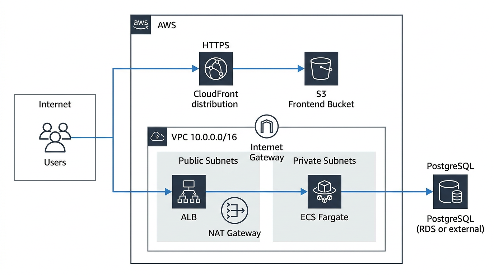
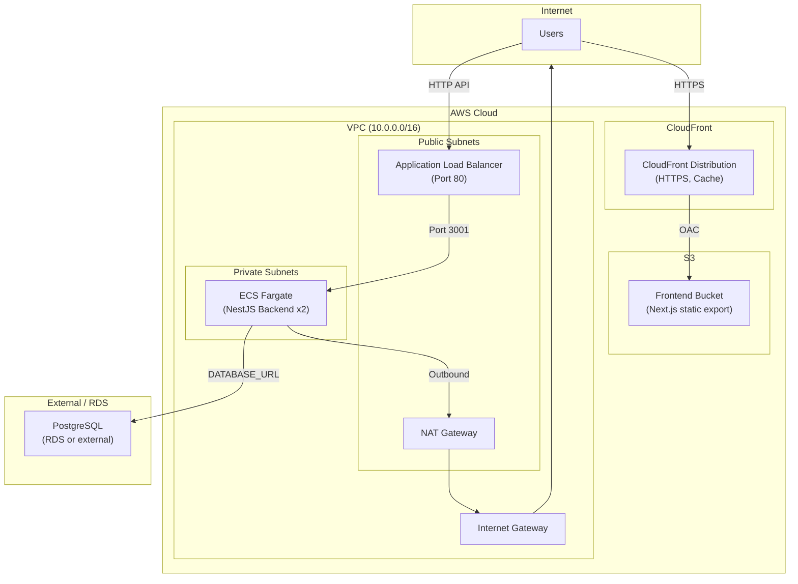

# AWS Infrastructure Architecture — Sentiment App

Sơ đồ kiến trúc AWS cho ứng dụng Sentiment (NestJS backend + Next.js frontend).

## Diagram (Mermaid)

## Component Overview

| Layer | Component | Template | Description |
|-------|-----------|----------|-------------|
| **Network** | VPC | network.yaml | 10.0.0.0/16, 2 public + 2 private subnets (multi-AZ) |
| | Internet Gateway | network.yaml | Outbound/inbound for public subnets |
| | NAT Gateway | network.yaml | Outbound-only for private subnets (e.g. ECS → PostgreSQL/RDS) |
| **Frontend** | S3 Bucket | s3-cloudfront-frontend.yaml | Static Next.js export, private, SSE |
| | CloudFront | s3-cloudfront-frontend.yaml | HTTPS, caching, OAC to S3 |
| **Backend** | ALB | ecs-backend.yaml | Internet-facing, public subnets, port 80 → Target Group |
| | ECS Fargate | ecs-backend.yaml | Tasks in private subnets, port 3001, no public IP |
| | CloudWatch Logs | ecs-backend.yaml | /ecs/{ProjectName}-backend |
| **Database** | RDS PostgreSQL | rds.yaml | Optional; single instance in private subnets, SG allows 5432 from VPC; use endpoint as DATABASE_URL for backend |
| **External** | PostgreSQL | — | Or use external Postgres (DATABASE_URL in env) if not using rds.yaml |

## Data Flow

1. **Frontend**: User → CloudFront (HTTPS) → S3 (via OAC). Static assets cached at edge.
2. **API**: User → ALB (HTTP) → ECS Fargate (private) → PostgreSQL (RDS or external, outbound via NAT).

## Security

- ECS tasks only accept traffic from ALB (security group).
- S3 bucket is private; only CloudFront can read via OAC.
- Backend has no public IP; all egress via NAT Gateway.
